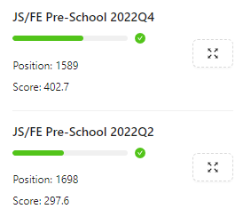

## [rsschool-cv]()

# Volha Sabich

### Junior Frontend Developer


> ### Contact information:

- E-mail: olgasabich@mail.ru
- Telegram: @ssabitch
- GitHub [OlgaSabich](https://github.com/OlgaSabich)
- Discord: chmonya3261

> ### About me

I am a novice frontend developer. At the moment I work in a large company that is engaged in retail trade as a marketer. I dream of changing my job to one that I like more than market

> ### Skills

- Web-development: HTML5, CSS3
- Version control: GIT, Github
- Office software: MS Visio, MS Excel
- Engineering: AutoCAD
- Graphics: Adobe Photoshop

> ### Education

- [Belarusian National Technical University](https://bntu.by/)
- RS Pre-school  
  

> ### Code Examples

```
function solution(str, ending){
  if(str.endsWith(ending)){
    return true;
  }
  else {return false;}
}
```

> ### Languages

- _Russian-C2_
- _Belarussian-C1_
- _Ukrainian-B1_
- _English-B1_

> ### [My first cv](https://github.com/OlgaSabich/rsschool-cv-old)


